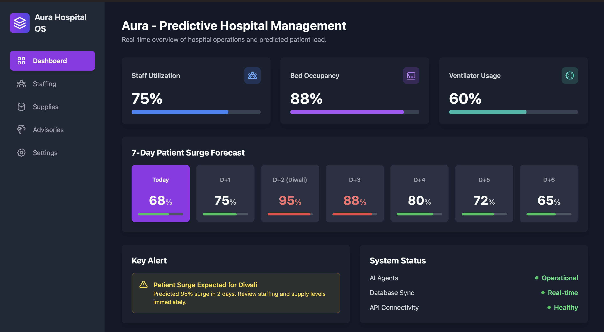

# 🏥 Aura - Predictive Hospital Management

[](https://www.typescriptlang.org/)
[](https://reactjs.org/)
[](https://vitejs.dev/)
[](https://ai.google.dev/)

**An intelligent, AI-powered hospital management system designed for healthcare facilities in India, providing predictive analytics and proactive recommendations for staffing, supplies, and public health advisories.**

[View App in AI Studio](https://ai.studio/apps/drive/1d880cvUXMETYIHIWZpwP6cv8JDA4t0-3) | [Report Bug](../../issues) | [Request Feature](../../issues)

</div>

---

## 📋 Table of Contents

- [Overview](#-overview)
- [Key Features](#-key-features)
- [AI Agents](#-ai-agents)
- [Technology Stack](#-technology-stack)
- [Screenshots](#-screenshots)
- [Getting Started](#-getting-started)
- [Project Structure](#-project-structure)
- [Usage](#-usage)
- [Configuration](#-configuration)
- [Contributing](#-contributing)
- [License](#-license)

---

## 🌟 Overview

**Aura** is a cutting-edge predictive hospital management platform that leverages Google's Gemini AI to help hospitals in India prepare for high-demand periods like festivals (Diwali, Holi), monsoons, and other events that historically cause patient surges.

The system employs three specialized AI agents that analyze hospital data and generate actionable recommendations:

- **🩺 Florence** - Staffing & Scheduling Expert
- **💊 Caduceus** - Supply Chain Analyst
- **📢 Charaka** - Public Health Communicator

By proactively analyzing trends and making data-driven predictions, Aura ensures hospitals are always prepared, reducing wait times, preventing supply shortages, and improving patient outcomes.

---

## ✨ Key Features

### 📊 **Real-Time Dashboard**

- **7-Day Patient Surge Forecast**: Visual representation of predicted patient loads
- **Resource Utilization Metrics**: Live tracking of staff, beds, and ventilator usage
- **System Health Monitoring**: Real-time status of AI agents, database sync, and API connectivity
- **Critical Alerts**: Immediate warnings for predicted surges (e.g., 95% increase during Diwali)

### 👨‍⚕️ **Intelligent Staffing Management**

- View and manage hospital staff across specialties (Doctors, Nurses, Technicians, etc.)
- Real-time status tracking (On Duty, On Call, Off)
- Shift management (Morning, Evening, Night)
- **AI-Powered Recommendations**: Florence analyzes staff allocation and surge predictions to suggest optimal staffing adjustments
- Inline editing with instant database updates

### 🏥 **Smart Supply Chain Management**

- Comprehensive inventory tracking for medical supplies
- Visual stock level indicators with color-coded alerts
- Category-based organization (Respiratory, Emergency, Medications, etc.)
- **AI-Driven Procurement Insights**: Caduceus identifies low-stock items and predicts high-demand supplies based on forecasted events
- Real-time stock updates with capacity management

### 📣 **Public Health Advisory System**

- Generate contextual health advisories for patients and the public
- Pre-configured topics: Monsoon Health, Diwali Safety, Heat Waves, COVID-19 Boosters
- Custom topic generation for emerging health concerns
- **AI-Generated Content**: Charaka creates clear, authoritative, and culturally relevant health communications
- Conversation history tracking for reference

### 🎨 **Modern User Interface**

- Responsive design for desktop, tablet, and mobile devices
- Dark mode optimized for reduced eye strain during long shifts
- Intuitive navigation with sidebar (desktop) and bottom navigation (mobile)
- Real-time loading states and error handling
- Accessible and inclusive design patterns

---

## 🤖 AI Agents

Aura's intelligence is powered by three specialized AI agents, each built on Google's Gemini 2.5 Flash model:

### 🩺 Florence - Staffing & Scheduling Expert

**Role**: Optimizes hospital staffing based on predicted patient loads and current staff availability.

**Capabilities**:

- Analyzes current staff distribution across specialties and shifts
- Cross-references with 7-day patient surge predictions
- Recommends staffing adjustments (additional shifts, on-call activations)
- Suggests specialty-specific allocations (e.g., more ICU nurses during respiratory illness surges)

**Example Output**:

> - Increase ICU nursing staff by 30% for the next 72 hours
> - Activate on-call respiratory specialists for Diwali shift coverage
> - Add evening shift general practitioners to handle overflow cases

---

### 💊 Caduceus - Supply Chain Analyst

**Role**: Ensures critical medical supplies are always available by predicting demand and identifying shortages.

**Capabilities**:

- Monitors real-time inventory levels across all supply categories
- Identifies items below low-stock thresholds
- Predicts high-demand supplies based on event types (burns during Diwali, respiratory during monsoon)
- Generates priority procurement recommendations

**Example Output**:

> - **URGENT**: Restock burn dressings to 80% capacity (current: 45%)
> - Order 200 additional oxygen cylinders for respiratory surge
> - Increase antibiotic inventory by 40% ahead of monsoon season

---

### 📢 Charaka - Public Health Communicator

**Role**: Creates patient-facing health advisories to educate the public and reduce preventable hospital visits.

**Capabilities**:

- Generates clear, concise health advisories on any topic
- Tailors communication for Indian healthcare context
- Provides actionable prevention tips and symptom guidance
- Maintains authoritative yet reassuring tone

**Example Output** (Diwali Safety):

> **Diwali Safety: Burns & Air Quality**
>
> - Keep a first-aid kit with burn ointment readily available
> - Light firecrackers in open spaces; never indoors
> - Wear cotton clothing; avoid synthetic fabrics near flames
> - If you have asthma or respiratory conditions, stay indoors during peak firecracker hours
> - Seek immediate medical attention for burns larger than 2 inches

---

## 🛠 Technology Stack

| Component            | Technology                                 |
| -------------------- | ------------------------------------------ |
| **Frontend**         | React 19.2 + TypeScript                    |
| **Build Tool**       | Vite 6.2                                   |
| **AI/ML**            | Google Gemini 2.5 Flash API                |
| **State Management** | React Hooks (useState, useEffect, useMemo) |
| **Data Storage**     | LocalStorage (Browser-based persistence)   |
| **Styling**          | TailwindCSS (utility-first CSS)            |
| **Icons**            | Custom SVG components                      |
| **Type Safety**      | TypeScript 5.8                             |

---

## 📸 Screenshots

### Dashboard - Real-Time Hospital Overview


_7-day patient surge forecast, resource utilization metrics, and critical alerts at a glance_

---

### Staff Management - AI-Powered Staffing Recommendations


_Manage hospital staff with real-time status updates and receive intelligent staffing suggestions from Florence_

---

### Supply Chain - Predictive Inventory Management


_Track medical supply levels with visual indicators and get procurement recommendations from Caduceus_

---

### Advisory System - Public Health Communications


_Generate and review patient advisories on seasonal health topics with AI agent Charaka_

---

## 🚀 Getting Started

### Prerequisites

- **Node.js** (v18 or higher) - [Download](https://nodejs.org/)
- **npm** (comes with Node.js)
- **Gemini API Key** - [Get your free API key](https://ai.google.dev/)

### Installation

1. **Clone the repository**

   ```bash
   git clone https://github.com/MADEYE42/AuraIn.git
   cd AuraIn
   ```

2. **Install dependencies**

   ```bash
   npm install
   ```

3. **Configure environment variables**

   Create or edit the `.env.local` file in the project root:

   ```bash
   API_KEY=your_gemini_api_key_here
   ```

   Replace `your_gemini_api_key_here` with your actual Gemini API key from [Google AI Studio](https://ai.google.dev/).

4. **Start the development server**

   ```bash
   npm run dev
   ```

5. **Open the app**

   Navigate to [http://localhost:5173](http://localhost:5173) in your browser.

### Build for Production

```bash
npm run build
```

The optimized production build will be generated in the `dist/` directory.

### Preview Production Build

```bash
npm run preview
```

---

## 📁 Project Structure

```
aura---predictive-hospital-management/
├── components/              # React components
│   ├── Advisories.tsx      # Public health advisory interface
│   ├── BottomNav.tsx       # Mobile bottom navigation
│   ├── Dashboard.tsx       # Main dashboard view
│   ├── Settings.tsx        # App settings (placeholder)
│   ├── Sidebar.tsx         # Desktop sidebar navigation
│   ├── Staffing.tsx        # Staff management interface
│   ├── Supplies.tsx        # Supply chain interface
│   └── icons/
│       └── Icons.tsx       # Custom SVG icon components
├── data/
│   ├── agents.ts           # AI agent configurations (Florence, Caduceus, Charaka)
│   └── mockData.ts         # Sample hospital data (staff, supplies, predictions)
├── services/
│   ├── dbService.ts        # LocalStorage database operations
│   ├── firebaseService.ts  # Firebase integration (future use)
│   └── geminiService.ts    # Gemini API integration
├── screenshots/            # UI screenshots for README
├── App.tsx                 # Main application component
├── index.tsx               # Application entry point
├── types.ts                # TypeScript type definitions
├── vite.config.ts          # Vite configuration
├── tsconfig.json           # TypeScript configuration
├── package.json            # Project dependencies
└── README.md               # This file
```

---

## 📖 Usage

### Navigating the App

**Desktop**: Use the sidebar on the left to switch between views  
**Mobile**: Use the bottom navigation bar to switch between views

### Managing Staff

1. Navigate to **Staffing** view
2. Review current staff list and AI recommendations from Florence
3. Click the **Edit** icon (✏️) to modify staff status or shift
4. Select new values from dropdowns and click **Save** (✓) or **Cancel** (✕)

### Managing Supplies

1. Navigate to **Supplies** view
2. Review inventory levels and Caduceus' procurement recommendations
3. Click the **Edit** icon (✏️) to adjust stock levels
4. Enter new stock value (respecting capacity limits) and click **Save** (✓)

### Generating Health Advisories

1. Navigate to **Advisories** view
2. **Option 1**: Click a pre-configured topic button (e.g., "Diwali Safety")
3. **Option 2**: Enter a custom topic in the text area and click **Generate Advisory**
4. Review the AI-generated advisory from Charaka in the conversation history

### Viewing Dashboard Insights

1. Navigate to **Dashboard** (default view)
2. Review:
   - Resource utilization percentages (Staff, Beds, Ventilators)
   - 7-day patient surge forecast (color-coded by severity)
   - Critical alerts (e.g., upcoming festival surge warnings)
   - System health status (AI agents, database, API)

---

## ⚙️ Configuration

### Environment Variables

| Variable  | Description                | Required |
| --------- | -------------------------- | -------- |
| `API_KEY` | Your Google Gemini API key | ✅ Yes   |

### Modifying Mock Data

For testing or demo purposes, you can modify the sample data:

- **Staff Data**: Edit `data/mockData.ts` → `staffData` array
- **Supply Data**: Edit `data/mockData.ts` → `suppliesData` array
- **Prediction Data**: Edit `data/mockData.ts` → `predictionData` array

Example:

```typescript
// data/mockData.ts
export const predictionData: PredictionData[] = [
  { day: "Mon (Diwali)", predictedSurge: 95 },
  { day: "Tue", predictedSurge: 80 },
  // ... more days
];
```

### Customizing AI Agents

To modify agent behavior, edit the prompts in `services/geminiService.ts`:

```typescript
// services/geminiService.ts
export const generateStaffingRecommendations = async (
  staff: StaffMember[],
  predictions: PredictionData[]
): Promise<string> => {
  const prompt = `
    You are Florence, an expert hospital administrator AI...
    [Modify this prompt to change Florence's behavior]
  `;
  return generateContent(prompt);
};
```

---

## 🤝 Contributing

Contributions are welcome! Please follow these steps:

1. **Fork the repository**
2. **Create a feature branch** (`git checkout -b feature/AmazingFeature`)
3. **Commit your changes** (`git commit -m 'Add some AmazingFeature'`)
4. **Push to the branch** (`git push origin feature/AmazingFeature`)
5. **Open a Pull Request**

### Development Guidelines

- Follow TypeScript best practices
- Maintain consistent code formatting
- Add comments for complex logic
- Update documentation for new features
- Test on multiple screen sizes (responsive design)

---

## 📄 License

This project is licensed under the MIT License. See the [LICENSE](LICENSE) file for details.

---

## 🙏 Acknowledgments

- **Google Gemini AI** for powering the intelligent recommendation system
- **React & Vite** communities for excellent developer tools
- **Healthcare professionals** in India who inspire solutions like Aura

---

## 📧 Contact

**Gouresh Madye** - [@MADEYE42](https://github.com/MADEYE42)

**Project Link**: [https://github.com/MADEYE42/AuraIn](https://github.com/MADEYE42/AuraIn)

---

<div align="center">

**⭐ Star this repository if you find it helpful!**

Made with ❤️ for improving healthcare outcomes in India

</div>
